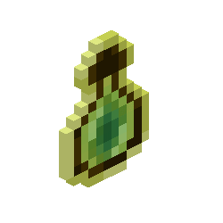
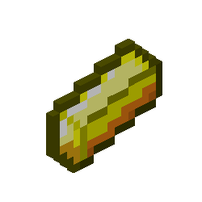
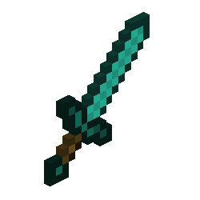

  

#

Me chamo Rafael Ribeiro, tenho 23 anos e sou Mineiro. Atualmente curso Bacharelado em Sistema de Informação no IFNMG. Gosto de programar e resolver problemas, curioso sobre novas linguagem e tecnologias. Sempre aprendendo mais.
 
#

<h3 align="left">Redes de Contato!</h3>

<h3 align="left">My Stack ~</h3>

 
 

<h3 align="left">GitHub Stats</h3>

  

<picture align="center">
  <source media="(prefers-color-scheme: dark)" srcset="https://raw.githubusercontent.com/rafaelribeirocorreia/rafaelribeirocorreia/output/github-contribution-grid-snake-dark.svg">
  <source media="(prefers-color-scheme: light)" srcset="https://raw.githubusercontent.com/rafaelribeirocorreia/rafaelribeirocorreia/output/github-contribution-grid-snake-dark.svg">
  
</picture>
